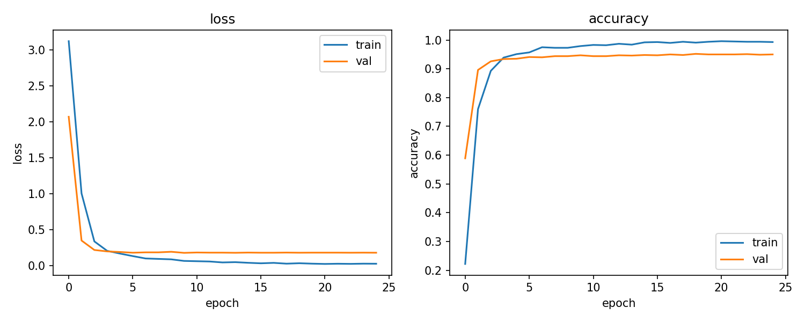

# peft-vit-demo


Parameter-efficient fine-tuning of a Vision Transformer with LoRA. A ViT-B/16
pretrained on ImageNet is adapted to the Oxford-IIIT Pets dataset (37 cat and
dog breeds) by training small low-rank adapters on the attention query/value
projections while the backbone stays frozen. It reaches **94.4% top-1**
accuracy while updating only **0.38%** of the model's parameters.

## Results

| backbone | dataset          | top-1 acc | trainable params | % of total |
|----------|------------------|-----------|------------------|------------|
| ViT-B/16 | Oxford-IIIT Pets | 94.4%     | 323K             | 0.38%      |

LoRA rank 8 on q/v, 10 epochs, AdamW with a cosine schedule, mixed precision.



## How it works

`timm` provides the pretrained ViT, whose attention packs q, k and v into a
single fused linear layer. [`src/lora.py`](src/lora.py) wraps that layer and
adds a low-rank delta `(B · A · x) · α/r` to the q and v blocks only, with `B`
initialised to zero so training starts exactly from the pretrained model.
Everything except the adapters and the classifier head is frozen
([`src/model.py`](src/model.py)).

## Run it

```bash
python -m venv .venv && source .venv/bin/activate
pip install -r requirements.txt

# full run (downloads Oxford-IIIT Pets on first use)
python train.py

# config is composable — override anything from the command line
python train.py train.epochs=20 data.batch_size=64 model.lora.r=16
```

Results are written to `results/` (training curve + `metrics.json`); the best
checkpoint goes to `outputs/`.

### Quick smoke test (CPU, no downloads)

```bash
python train.py +experiment=smoke
```

Runs the whole pipeline in seconds on random data with a non-pretrained model.

### Experiment tracking

Runs are logged to Weights & Biases in **offline** mode by default, so it works
without an account. To sync to the cloud:

```bash
wandb login
python train.py wandb.mode=online
```

## Layout

```text
configs/   hydra configs (data / model / train / experiment)
src/       data, lora, model, training engine, plotting
train.py   entry point
results/   training curve + metrics.json
```
